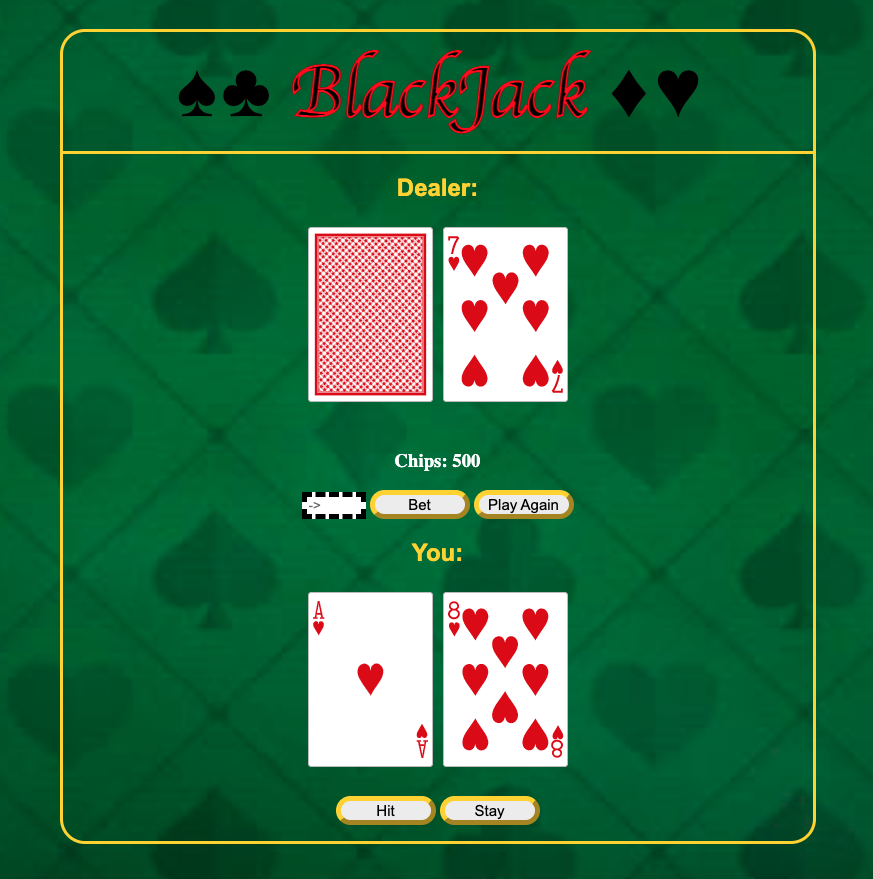
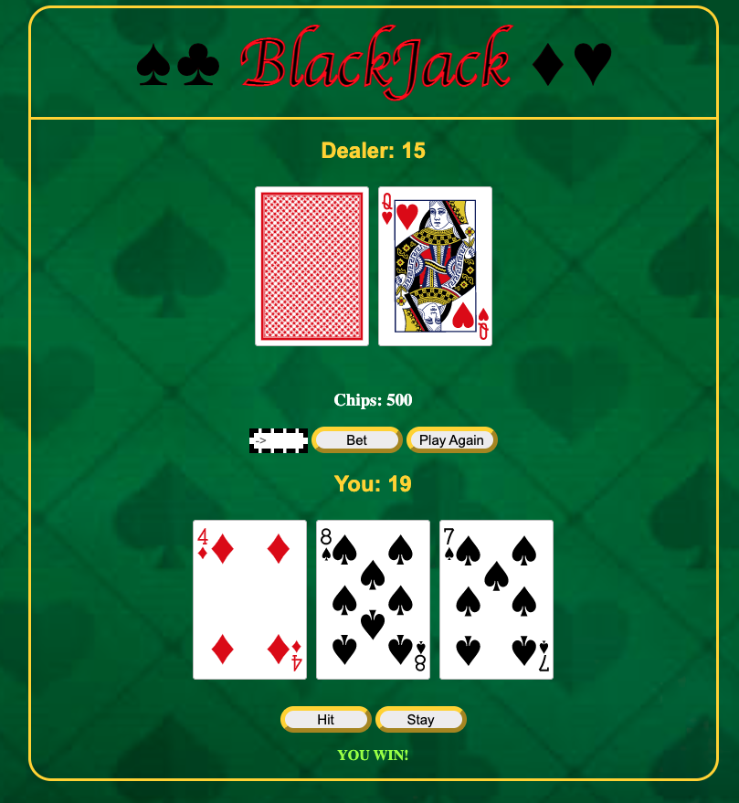

# BlackJack Game

A simple Blackjack game with real cards, hit, stay, bet and play-again buttons!

# Screenshot

# Technologies Used

- JavaScript
- HTML
- CSS
- CardStarter CSS Library

# Getting Started

[Click to Play BlackJack!](https://seanh101.github.io/Blackjack-game/)

Instructions:
1) New game will start upon load.
2) Two cards will be dealt to you (the player) and two cards will be dealt to the dealer. One of the dealer's cards will be face down.
3) Your goal is to get a higher hand than the dealer without going over 21.
Cards 2 through 10 are worth their face value. Face cards (J, Q, K) are worth 10, and Aces can be worth either 1 or 11, depending on which value would be more beneficial for your hand.
4) You can choose to "hit" (take another card) or "stay" (keep your current hand) by clicking the corresponding button.
5) If your hand goes over 21, you lose automatically.
6)If you choose to "stay," the dealer will reveal their face-down card and draw more cards until their hand is worth at least 17.
7) If the dealer's hand goes over 21, you win automatically. Otherwise, the higher hand wins. If you and the dealer have the same hand value, it's a tie.
8) Enter the number of chips you want to wager in the "BET" input.
9) You can choose to play again without resetting your chips by clicking the "Play Again" button. Good luck!

# Next Steps

- Split hand function
- Double down function
